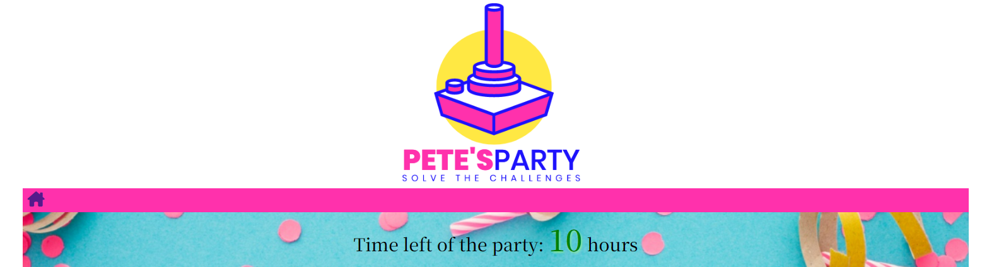

# Welcome to Pete's Party

Pete's Party is a retro-style javascript game. The basic idea is a interactive story that evolves differentlty depending on players choices and results on challenges. The target is to help and guide Pete so that he reaches his best friends party before it ends.

The intended audience is english speaking with some basic logical/mathematical abbiliities.

Live site can be visited at: [Pete's Party website](https://sherkaerka.github.io/Petes-party/ "Pete's Party")
 
 
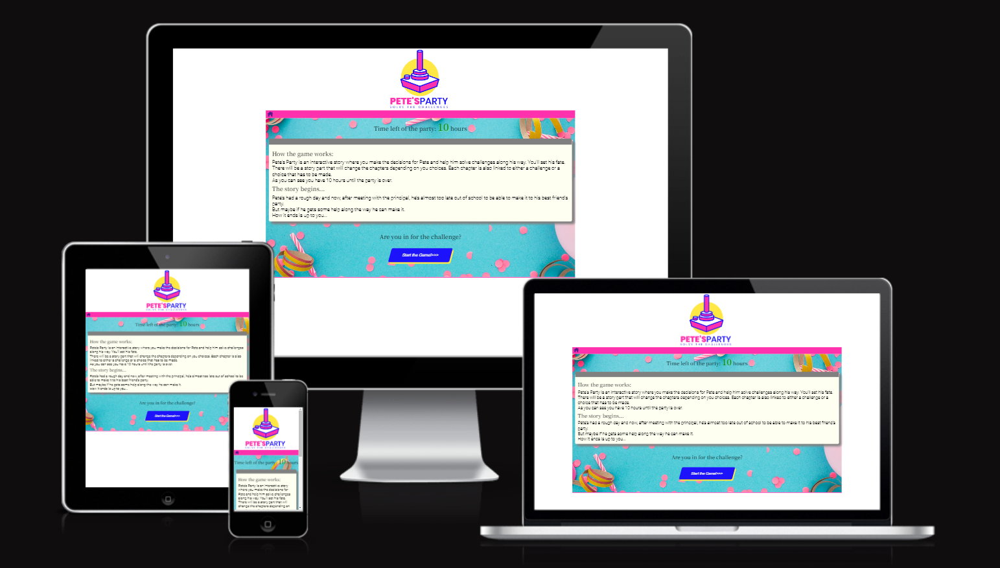
 
 

# Table of contents
* [User Experience](#user-experience-a-nameuser-experiencea)
    * [User Stories](#user-stories-a-nameuserstoriesa)
    * [Wireframes](#wireframes-a-namewireframesa)
    * [Site Structures](#site-structures-a-namesitestructuresa)
    * [Design Choices](#design-choices-a-namedesignchoicesa)
        * [Typography](#typography-a-nametypographya)
        * [Color Scheme](#color-scheme-a-namecolorschemea)
* [Features](#features-a-namefeaturesa)
    * [Start](#start-a-namestarta)
        * [Navigation Menu](#navigation-menu-a-namenavigationmenua)
        * [Time Left](#time-left-a-nametimelefta)
        * [Story Area](#story-area-a-namestoryareaa)
        * [Game Area](#game-area-a-namegameareaa)
        * [Alerts](#alerts-a-namealertsa)
        * [Different endings](#different-endings-a-namedifferent-endingsa)
        * [Footer](#footer-a-namefootera) 
    * [Future Features](#future-features-a-namefuturefeaturesa)
* [Technologies Used](#technologies-used-a-nametechuseda)
* [Testing](#testing-a-nametestinga)
* [Deployment](#deployment-a-namedeploymenta)
    * [How to fork the repository on Github](#how-to-fork-the-repository-on-github-a-nameforka)
    * [How to create a local clone](#how-to-create-a-local-clone-a-namelocalclonea)
* [Credits](#credits-a-namecreditsa)
    * [Content](#content-a-namecontenta)
    * [Media](#media-a-namemediaa)
* [Acknowledgements](#acknowledgements-a-nameacknowledgementsa)

## User Experience 

### User Stories 
* As a As a user I want to be able to navigate through the whole site smoothly, no matter device.
* As a user I quickly want to understand the purpose of the site upon loading it.
* As a user I want to understand how to play the game.
* As a user I want to know what the goal is.
* As a user I want to be inspired to try the game agian.
* As a user I want to have feedback on my progress and result.
* As a user I want to tell my friends about this great game.

[Back to top](#table-of-contents)

### Wireframes 
Wireframes to Pete's Party were created in [Balsamiq](https://balsamiq.com/) and shows general ideas in smartphone set-up. As seen below the basic idea is to try mobile-first design and only set max-width as media query for larger screens.

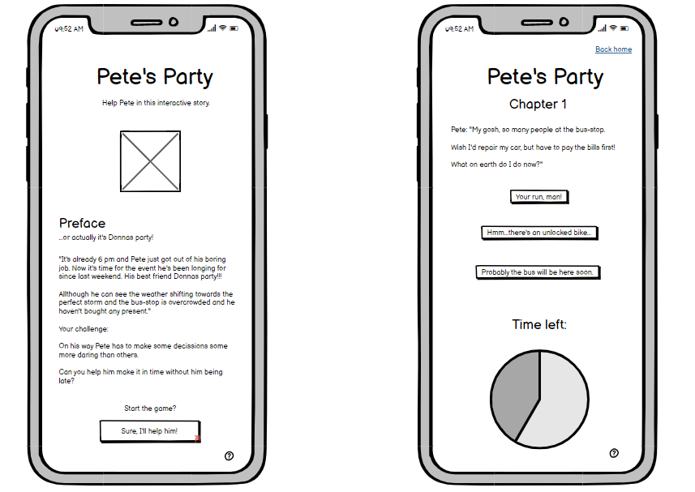

[Back to top](#table-of-contents)

### Site Structures 
Pete's Party is a one-page site and uses javascript to remove and add content as the player interacts with the game. The basic stucture is a story-area where the chapters are presented and a game-area where the challenges and interaction takes place.

[Back to top](#table-of-contents)

### Design Choices 
Since it's really basic javascript functions in use I wished to apply some sort of retro-feeling about the page. Almost like you found a really old and forgotten site that just happened to be a bit responsive.

#### Typography 

Body uses different font weight and spacing of Roboto with a fallback to sans-serif. Heagings usiing Noto Serif HK with a fallback to sans-serif. The logo to Pete's Party with a retro-joystick is created with [Freepik](https://www.freepik.com/).

#### Color scheme 

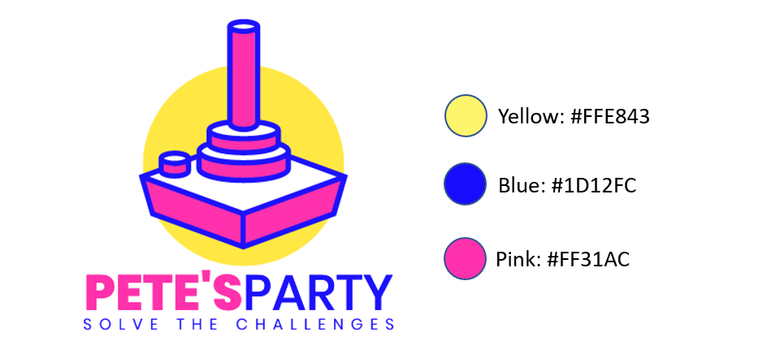

[Back to top](#table-of-contents)

## Features 
Pete's party is set up as a basic javascript game with the ambition to include a few different challenges and paths to interact with the player and to encourage the player to play several times and try different ways of completing the game.

### Start 
The layout of the page will be more or less static throughout the game:

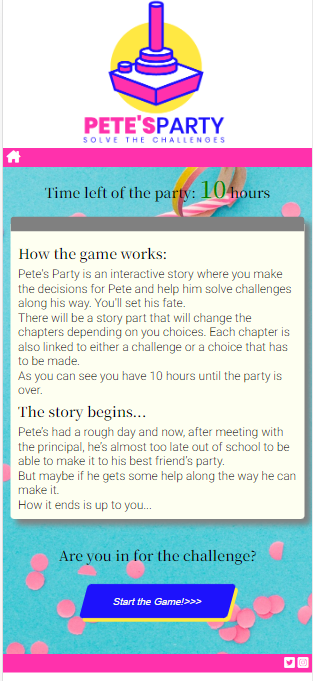

#### Navigation menu 
As seen above the navigation menu contains an house-icon that whenever clicked will reset the game and take you back to the starting page.
 
[Back to top](#table-of-contents)

#### Time left 
When the game start's you have 10 hours until the party is over. Then as you play the game, depending on your choices and abiliity to solve the challenges it will count down. Unless you make it in time it will be Game Over.

 
#### Story area 
The Story area is where the chapters and story is presented. It's basically meant as an interactive book.

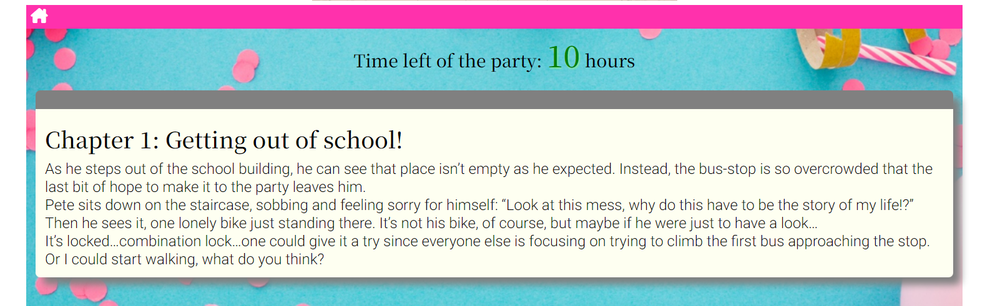
[Back to top](#table-of-contents)

#### Game area 
The Game area is where the player either make choices of what to do or interact in challenges.

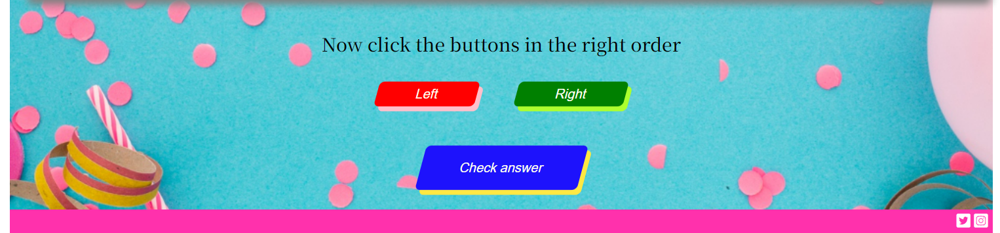
[Back to top](#table-of-contents)

#### Alerts 
A lot of the game feedback is coming through alerts and they contribute to the "vibe" of the game.

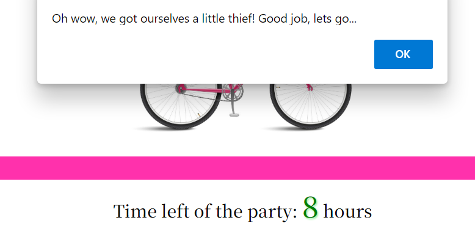
 
[Back to top](#table-of-contents)

#### Different endings 
The game has five different endings to inspire the user to try again just for fun or to get better results. They consist of "Times up", "Jail", "Passing out", "Getting there without any flowers" and the top result where everything is in place and he's the "Winner".

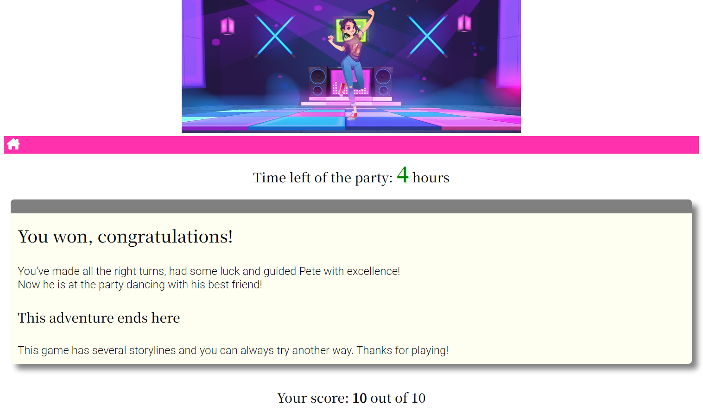
 
[Back to top](#table-of-contents)

#### Footer 
Appears in the exact same way on all pages. Shows social buttons and are intended to share the game to friends.

[Back to top](#table-of-contents)

### Future Features 
Some possible improvements but not limited to:

* Add more alternative paths and challenges
* Add music and soundeffects
* Make all challenges dynamic, meaning that order and content change each time

[Back to top](#table-of-contents)

## Technologies Used 

* HTML5 - provides the content and structure for the website.
* CSS3 - provides the styling.
* Javascript - provides the behaviour of the website. 
* Balsamiq - used to create the wireframes.
* Gitpod - used to deploy the website.
* Github - used to host and edit the website.

[Back to top](#table-of-contents)

## Testing 

Please refer to [testing protocol](./TESTING.md) for more information on testing Pete's Party.

[Back to top](#table-of-contents)

## Deployment 

The site was deployed to GitHub pages. The steps to deploy a site are as follows:

1. In the GitHub repository, navigate to the **Settings** tab.
2. Once in Settings, navigate to the **Pages** tab on the left hand side.
3. Under **Source**, select the branch to **master**, then click **save**.
4. Once the master branch has been selected, the page will be automatically refreshed with a detailed ribbon display to indicate the successful deployment.

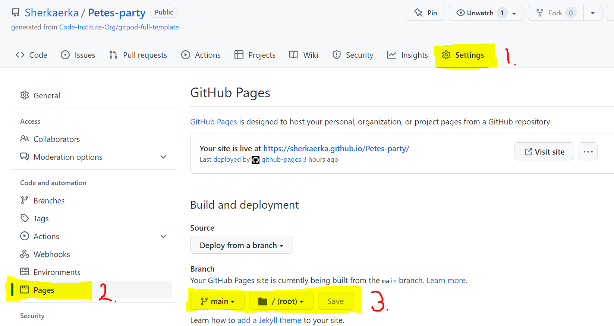

This is the link to the live Github repository: https://github.com/Sherkaerka/Petes-party

### How to fork the repository on Github 

A copy of the GitHub Repository can be made by forking the GitHub account. This copy can be viewed and changes can be made to the copy without affecting the original repository. Take the following steps to fork the repository;

1. Log in to GitHub and locate the [repository](https://github.com/Sherkaerka/Petes-party).
2. On the right hand side of the page inline with the repository name is a button called **'Fork'**, click on the button to create a copy of the original repository in your GitHub Account.

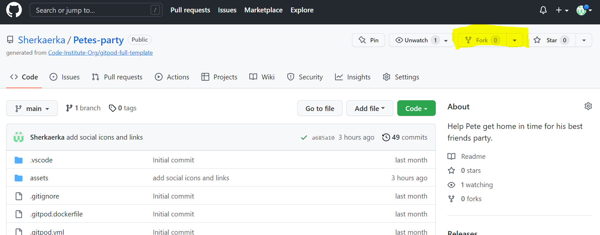

### How to create a local clone 
The method from cloning a project from GitHub is below:

1. Under the repository’s name, click on the **code** tab.
2. In the Clone with HTTPS section, click on the **copy icon** to copy the given URL.

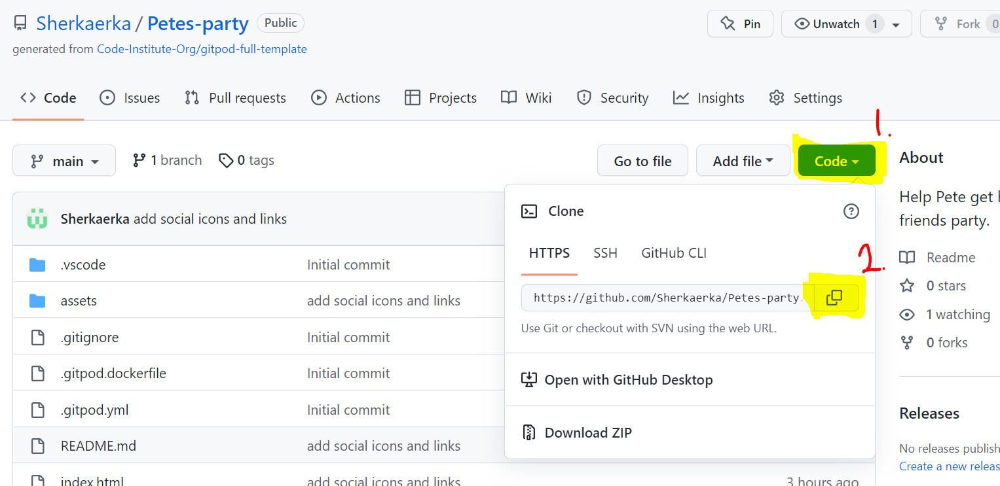

3. In your IDE of choice, open **Git Bash**.
4. Change the current working directory to the location where you want the cloned directory to be made.
5. Type **git clone**, and then paste the URL copied from GitHub.
6. **Press enter** and the local clone will be created.

[Back to top](#table-of-contents)

## Credits 

### Content 
The font came from [Google Fonts](https://fonts.google.com/about).
Fonts were choosen with [Canva](http://www.canva.com)
The colour palate was compiled from the logo [Freepik](https://www.freepik.com/).
The icons came from [Font Awesome](https://fontawesome.com/).
[Balsamiq](https://balsamiq.com/) was used to create the wireframes.

### Media 
All images are taken from [Freepik](https://www.freepik.com/).

[Back to top](#table-of-contents)

## Acknowledgements 

Pete's Party is a non-profit no money involved site that was developed as Milestone Project no2 for [Code Institute](https://codeinstitute.net "Code Institute").

Thanks to my mentor [Precious Ijege](https://www.linkedin.com/in/precious-ijege-908a00168/) for unvaluable guidance and tips.

Erik Lindén 2022

[Back to top](#table-of-contents)