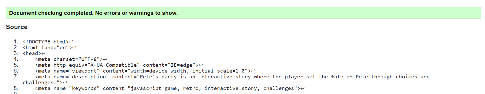
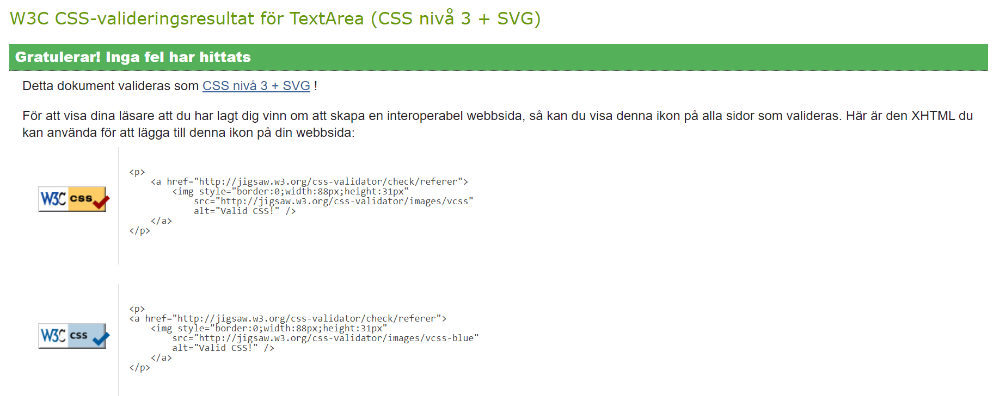

# Testing

## Code validation

The Pete's Party site has be throughly tested. All the code has been run through the [W3C html Validator](https://validator.w3.org/) and the [W3C CSS Validator](https://jigsaw.w3.org/css-validator/).

The HTML validator results for each page are below:

* Index.html

The CSS validator results are below:

# Resposiveness test
The responsive design tests were carried out manually with [Google Chrome DevTools](https://developer.chrome.com/docs/devtools/) and [Responsive Design Checker](https://responsivedesignchecker.com/).

Screen dimentions tested:
* >1200px
* <1200px
* Ipad Air
* Iphone SE
* Suface Pro 7
* Nest Hub
* Galaxy S8+

Parameters checked and passed:
* Render
* Images
* Links
* Buttons
* Inputs

# Browser compatibillity
Pete's Party site was tested on the following browsers with no visible issues for the user. Google Chrome, Microsoft Edge, Safari and Mozilla Firefox. Appearance, functionality and responsiveness were consistent throughout for a range of device sizes and browsers.

# User stories testing
* As a As a user I want to be able to navigate through the whole site smoothly, no matter device.
    * The only choice of navigation is the house-icon present on all chapters and challenges. It will restart the game.
* As a user I quickly want to understand the purpose of the site upon loading it.
    * 
* As a user I want to understand how to play the game.
* As a user I want to know what the goal is.
* As a user I want to be inspired to try the game agian.
* As a user I want to have feedback on my progress and result.
* As a user I want to tell my friends about this great game.
  

### Known bugs, minor issues and solutions:

During validation these three main bugs occured:
* **Id duplicate on Company name**: This was due to id was used and I reused that id in the footer. Solution was to add it to class.
* **Stray ends**: I unfortunately created this stray end very early on so it was copied via the header to all pages. These were removed.
* **Inline styling on youtube videos**: I did not think of this when embedding the videos and everything worked fine, allthough I had the size-settings in the service.html. When removed I got a bit surprised how it acted until I found out that I had to have an extra div and give that parameters to maintain original proportions.

# Additional testing

## Lighthouse
The site was also tested using [Google Lighthouse](https://developer.chrome.com/docs/lighthouse/overview/) in Chrome Developer Tools to test each of the pages for:

Performance - How the page performs whilst loading.
Accessibility - Is the site acccessible for all users and how can it be improved.
Best Practices - Site conforms to industry best practices.
SEO - Search engine optimisation. Is the site optimised for search engine result rankings.

Back to [README.md](./README.md).