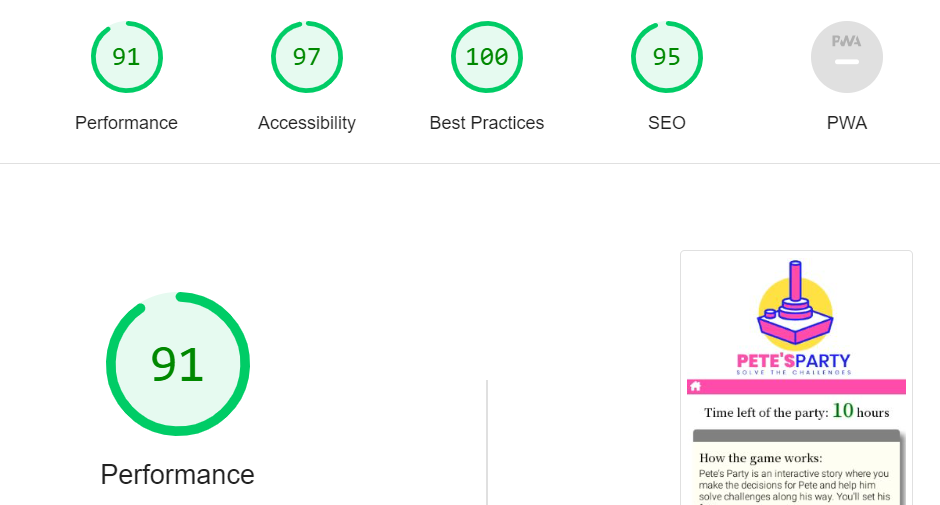

# Testing

## Code validation

The Pete's Party site has be throughly tested. All the code has been run through the [W3C html Validator](https://validator.w3.org/) and the [W3C CSS Validator](https://jigsaw.w3.org/css-validator/).

The HTML validator results for each page are below:

* Index.html

The CSS validator results are below:

To validate javascript JSHint was used:
45 ES6 warnings remaining.

# Resposiveness test
The responsive design tests were carried out manually with [Google Chrome DevTools](https://developer.chrome.com/docs/devtools/) and [Responsive Design Checker](https://responsivedesignchecker.com/).

Screen dimentions tested:
* >1200px
* <1200px
* Ipad Air
* Iphone SE
* Suface Pro 7
* Nest Hub
* Galaxy S8+

Parameters checked and passed:
* The weppage render well on any device.
* Images look good and load on any device.
* Links are working properly.
* Buttons are working properly and follow given design.
* Inputs are working on all type of devices.

# Browser compatibillity
Pete's Party site was tested on the following browsers with no visible issues for the user. Google Chrome, Microsoft Edge, Safari and Mozilla Firefox. Appearance, functionality and responsiveness were consistent throughout for a range of device sizes and browsers.

# User stories testing
* As a As a user I want to be able to navigate through the whole site smoothly, no matter device.
    * The only choice of navigation is the house-icon present on all chapters and challenges. It will restart the game.
* As a user I quickly want to understand the purpose of the site upon loading it.
    * The Logo kind of gives all: joystick indicating game, name of the game and also that it involves challenges.
* As a user I want to understand how to play the game.
    * After that you have your first header telling How the game works:.
* As a user I want to know what the goal is.
    * After that you have your first header telling How the game works:.
* As a user I want to be inspired to try the game agian.
    * The story-lines, different endings and challenges are to inspire a player to stay longer.
* As a user I want to have feedback on my progress and result.
    * There are 5 different endings that give different feedback to the player.
    * Also while in the game you have the time indicator present at all times.
* As a user I want to tell my friends about this great game.
    * Social icons in the footer are meant for sharing the game.
  

### Known bugs, minor issues and solutions:

During validation these main bugs occured:
* **Pick the lock inputs could be typed negative**: It was already set to min 0 and max 9, but with your keyboard you could still set negative numbers, allthough you would get an error and eventually loose it didn't look good. As a solution I thought that an extra feature for the game would be that the keyboard was temporarily disabled on that challenge. But that caused issues on tablet and phones. So instead I used the validation.validity function so that only positive inputs are possible.

* **Unexpected "let" issue when validating javascript code**: These are ES6 type and will be ignored.

* **Perfromance issues**: First lightouse testing came back with 81 in performance. Found out that images were too big. Made them smaller and performance went up.

* **Repetative code**: The code for clrearing story- and gaming-area was repetedly used. Replaced them wit a clearOut -function.

# Additional testing

## Lighthouse
The site was also tested using [Google Lighthouse](https://developer.chrome.com/docs/lighthouse/overview/) in Chrome Developer Tools to test each of the pages for:

Performance - How the page performs whilst loading.
Accessibility - Is the site acccessible for all users and how can it be improved.
Best Practices - Site conforms to industry best practices.
SEO - Search engine optimisation. Is the site optimised for search engine result rankings.

Back to [README.md](./README.md).